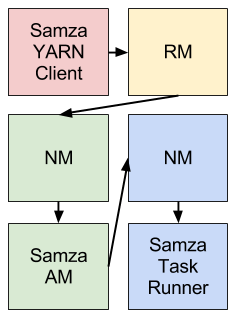
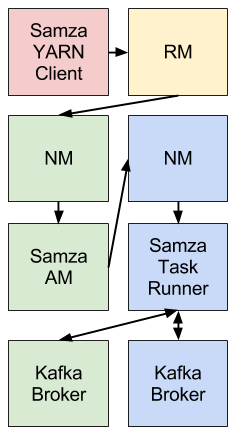

#架构

Samza由以下3成构成：  
- 数据流层.  
- 执行层.  
- 处理层.  

Samza provides out of the box support for all three layers.
Samza提供支持上面提到的所有三层。  
流: [Kafka](http://kafka.apache.org/)  
执行: [YARN](http://hadoop.apache.org/docs/current/hadoop-yarn/hadoop-yarn-site/YARN.html)  
处理: [Samza API  ](http://samza.incubator.apache.org/learn/documentation/latest/api/overview.html)

这三个部分组合在一起形成Samza:

此体系结构类似Hadoop的模式(还使用YARN为执行层,HDFS存储和MapReduce处理API):

在深入学习每一层之前,应该注意：Samza并不局限于支持Kakfa和YARN。Samza的执行和流层都是可插拔的,如果他们喜欢,开发者可以选择自己实现。

##Kafka

Kafka是一个分布式发布/订阅的消息排队系统,提供至少一次消息保证(即系统保证没有消息丢失,但是在特定的故障场景,消费者可能会收到同一消息不止一次)和高可用性分区(即流分区继续可用即使机器宕机)。

在Kafka中,每个流被称为主题。每个主题被称为Broker，可以有多个分区和副本并可跨多台机器。当生产者发送一条消息到一个主题,它提供了一个键,用于确定消息应该发送到哪个分区。Kafka Broker接收并存储发送的信息。kafka消费者可以从主题通过订阅消息读取所有分区上的主题。

Kafka有一些有趣的特性:

- 所有可以相同的消息保证在同一主题分区。这意味着,如果您想要阅读所有信息为一个特定的用户ID,您只需要阅读包含用户ID的消息分区,不是整个主题(假设用户ID作为键)。

- 主题分区是一个按消息的顺序存储,所以你可以使用递增的偏移量引用分区中的任何消息(像数组索引)。这意味着Broker不需要跟踪哪些消息已经被一个特定的消费者,消费者可以通过处理的最后一条消息的偏移量来存储和跟踪消息。然后知道偏移量比当前偏移量小的消息已经被处理,偏移量更大的消息尚未处理。

Kafka的更多细节,请参阅Kafka的[documentation](http://kafka.apache.org/documentation.html)页面。

##YARN

YARN(Yet Another Resource Negotiator)是Hadoop下一代集群调度器。它允许您分配一定数量的容器(进程)在一个集群中机器,和执行任意命令。

当应用程序与YARN集成,它看起来是这样的:

1. 应用程序:我想在两台机器上运行命令X，需要512 mb的内存。
2. YARN:酷,你的代码在哪?
3. 应用程序:http://path.to.host/jobs/download/my.tgz
4. YARN:我在节点node-1.grid 和node-2.grid上运行你的作业

Samza使用YARN来管理部署、容错、日志、资源隔离,安全性和本地性。简要概述YARN是低层的;从Hortonworks的[这个页面](http://hortonworks.com/blog/apache-hadoop-yarn-background-and-an-overview/)可以看到更好的概述。

####YARN的架构

YARN有三个重要组成部分:ResourceManager,NodeManager,ApplicationMaster。在一个YARN网格中,每台机器都运行着NodeManager,负责启动在机器上启动进程。ResourceManager会通知所有NodeManagers告诉他们运行什么。反过来，应用程序跟ResourceManager通信，告诉ResourceManager希望在集群上运行的具体程序。第三块,ApplicationMaster实际上是运行在集群YARN上的特定应用程序的代码。它负责管理应用程序的工作负载,申请容器(通常是UNIX进程)，处理容器失败通知。

####Samza and YARN

Samza提供YARN ApplicationMaster和YARN Job Runner。下图中给出Samza和YARN之间的集成(不同的颜色表示不同的宿主机):

Samza client 与YARN RM通信，开始一个新的Samza作业。YARN RM会向NM分配集群空间为Samza ApplicationMaster。一旦NM分配空间成功,它启动Samza AM。当Samza AM启动后,它向YARN RM申请一个或多个YARN容器来运行SamzaContainers。而后,RM让NMs分配相应空间的容器。一旦空间被分配,NMs就会启动Samza容器。

####Samza

Samza使用YARN和Kafka为对接流处理和分区提供了一个框架。所有的东西,放在一起,看起来像这样(不同的颜色表示不同的宿主机):

Samza client使用YARN来运行Samza作业:YARN启动和监控一个或多个SamzaContainers,和运行在这些容器内的处理代码(使用StreamTask API)。Samza StreamTasks的输入和输出来自Kafka(通常)同位置的Broker像NMs的机器一样。

##Example

让我们看一个真实的例子:假设我们想计算页面浏览量的数量。将编写类似的SQL:

    SELECT user_id, COUNT(*) FROM PageViewEvent GROUP BY user_id

现在虽然Samza不支持SQL,但想法是一样的。两种作业都必须计算该查询:一组消息的用户ID和计数。

第一个作业,完成分组发送所有使用相同的用户ID消息到一个中间的主题的相同的分区中。你可以通过使用用户ID作为键发出的消息来完成第一个任务,而这关键是映射到一个中间主题的分区(通常是通过一个散列的关键字取余分区的数量)。第二个任务从上面的主题消费。第二个作业的每个任务消耗一个分区中间主题,即所有用户id的一个子集的消息。每个任务有一个计数器的分区为每个用户ID,以及相应的计数器增加，当每次任务接收到一条消息,该消息带有一个特定用户ID。

如果您熟悉Hadoop,您可能认识到这是一个Map/Reduce操作,其中每个记录中与一个特定的键组成mapper,记录与相同的键组合在一起的框架,然后在减少计算步骤。Hadoop和Samza区别是Hadoop运作在一个固定的输入,而Samza是无限的数据流。

Kafka接收第一个作业发出的消息并缓冲在磁盘上,分布在多个机器上。这有助于系统容错:如果一台机器出现故障,没有消息丢失,因为他们被复制到其他机器。如果第二个作业无故的执行减缓或停止消费信息,第一个作业不受影响:磁盘缓冲区可以接收第一个作业积压的消息支到第二个作业赶上。

通过把主题分区,把流处理分解成作业和并行任务运行在多台机器上,Samza扩展流有很高的消息吞吐量。利用YARN和KAFKA,Samza达到了容错:如果一个进程或机器出现故障,自动重新在另一台机器上运行,继续处理未处理消息。