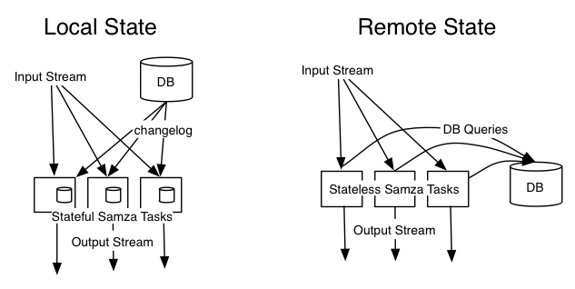

#对比说明

这里有一些高层的设计决策,是我们认为Samza不同于其他流处理项目的特点。

##流模型

Samza作业主要是流的输入和输出。Samza有很强的流模型,这不仅仅是一个简单的消息交换机制。 Samza流是一个分区,可复制,没分区有序的，多订阅者,无丢失的序列信息。流不仅仅是系统的输入和输出,而且是互相隔离处理过程的缓冲区。

这个强大的模型需要持久性、容错和流缓冲实现,但它有几个好处。

首先,下游处理阶段的延迟不能阻止一个上游的处理。Samza工作可以停止消费流几分钟,甚至几小时(也许是因为糟糕的部署,或长时间运行计算)但对上游的处理没有任何影响。这使得Samza适合处理所有数据流在一个大公司的大型部署:在不同的代码库,由不同的团队使用不同SLA，写时隔离是至关重要的。

这是出于我们的在Hadoop经验总结的离线处理管道。在Hadoop MapReduce作业处理阶段,处理阶段的输出是一个HDFS目录的文件。输入到下一个处理阶段只是前期产生的文件。我们发现这种强烈的隔离阶段可以由不同的团队数以百计的松散耦合的工作,组成一个离线处理生态系统。我们的目标是复制这种丰富的生态系统在近实时环境。

这个强大的模型的第二个好处是,所有的阶段是多订阅者。这意味着在实践中,如果一个人增加了一套产生输出数据流处理流,别人就能看到输出并使用它,并在其上进行构建,没有引入任何之间耦合的代码工作。快乐的副作用,这使得调试流容易,因为您可以手动检查任何阶段的输出。

最后,这个强大的流模型大大简化了Samza框架中功能的实现。每个作业只需要关心自己的输入和输出,在错误的情况下,每一个作业都可以独立地恢复和重新启动。不需要中央控制整个数据流图。

我们需要做出的权衡这个强流模型是消息写入磁盘。我们愿意让这种权衡因为MapReduce和HDFS表明持久存储可以提供非常高的读写吞吐量,而且几乎无限的磁盘空间。这个观察是Kafka的基础,它允许数百MB /秒的吞吐量,复制和许多每节点的TB磁盘空间。以这种方式使用时,磁盘的吞吐量通常不是瓶颈。

MapReduce有时被批评为写入磁盘是没有必要的。然而,这种批评不适用于流处理:批处理像MapReduce经常用于处理大型历史数据的集合在一个短的时间内(如查询一个月的数据在10分钟),而流处理大多需要跟上稳态的数据流(处理10分钟的数据在10分钟内)。这意味着原始流处理吞吐量要求,一般来说,数量级要低于批处理。

##状态

只有非常简单的流处理的问题是无状态的(即一次可以处理一条消息,独立于所有其他消息)。许多流处理应用程序需要一个作业来维护一些状态。例如:
- 如果你想知道有多少事件对于特定用户ID,你需要保持一个计数器为每个用户ID。
- 如果你想知道每天有多少不同的用户访问你的网站,你需要保持一组你今天已经产生至少有一个事件的所有用户id。
- 如果你想加入两个流(例如,如果你想要确定广告的点击率,加入广告印象事件流的广告点击事件)您需要存储事件从一个流,直到你收到相应的事件从另一个流。
- 如果你想增加事件和一些信息从数据库(例如,扩展一个页面浏览事件和一些信息的用户浏览页面),这项工作需要访问数据库的当前状态。

某些状态,例如任务的计数器,可以保存在内存,但随后,状态将失去如果作业重新启动。或者,您可以用远程数据库保存状态,但是性能会变得不可接受，因为你需要执行一个数据库查询你处理的每条消息。Kafka可以很容易地处理100 k - 500 k的消息/秒每节点(取决于消息大小),但是吞吐量对远程查询键值存储往往是接近1-5k每秒请求——慢两个数量级。

在Samza中,我们特别关心支持高性能、可靠的状态。关键是要保持状态位于每个节点(以便查询不需要在网络上),使它发生机器故障是通过复制状态变化到另一个流来提高健壮性。

这种结合数据库更改捕获的方法特别有趣。就拿上面的例子来说,你有一个页面浏览流包括用户浏览页面的ID,和你想增加活动用户的更多信息。乍一看,好像你别无选择,只能查询用户数据库查找你看到的每个用户ID(可能与一些缓存)。Samza,我们可以做得更好。

变化捕获意味着一些数据库中的数据变化,每次你得到一个事件告诉你改变什么。如果你有更改事件流,一路回到创建数据库时,可以通过重建流重建数据库的全部内容。更新日志流也可以用作Samza作业输入。

现在,您可以编写一个Samza作业,需要页面浏览事件和变更日志作为输入。你确保他们是划分在同一关键(例如,用户ID)。每次的更新日志事件出现时,你把更新后的用户信息写入任务的本地存储。每次翻页事件出现时,你从本地存储读取当前用户的信息。这样,你就可以把所有state位于一个任务,而且从不需要查询远程数据库。

实际上,你现在有一个主数据库副本,分成小分区,在相同的机器Samza任务。数据库写仍然需要去主数据库,但当你需要从数据库读取输入流处理一条消息,你可以去本地获取任务的状态。

这种方法不仅速度远远超过查询远程数据库,也更好操作。如果你是用samza处理一个大容量流,并使每条消息远程查询,您可以很容易地压倒数据库请求和影响其他服务使用相同的数据库。相反,当一个任务使用本地状态,它是独立于一切,所以它不会意外降低其他服务。

分区本地状态并不总是适当的,并且是不需要的——没有Samza防止调用外部数据库。如果你不能产生一个提要的从你的数据库所做的更改,或者你需要依靠只存在于一个远程服务逻辑,那么它可能更方便从你的Samza工作调用远程服务。但是如果你想使用本地状态时,它就没法工作了。

##执行框架

最终决定我们是不会在Samza构建一个定制的分布式执行系统。相反,目前执行是可插拔的,完全由YARN来管理。这有两个好处。

第一个好处是实用的:还有另一个聪明的人组成的团队来执行框架。YARN是发展迅速,已经支持一组丰富的功能在资源配额和安全方面。这允许您控制集群的一部分分配给用户和组,并控制资源利用率在单个节点上通过cgroups(CPU、内存等)。YARN是运行在大规模Hadoop集群上和可能会成为一个无处不在的层。因为Samza运行完全通过YARN,没有单独的守护进程或master在YARN集群外运行。换句话说,如果你已经有kafka和YARN,你为了运行Samza工作不需要再安装任何东西。

其次,我们与YARN完全组件化集成。它存在于一个单独的包,主要Samza框架并不取决于它在构建时。这意味着YARN可以被替换为其他虚拟化框架—特别是,我们感兴趣的AWS集成。许多公司在AWS本身就是一种虚拟化运行框架,Samza的目的等同于YARN:它允许您创建和销毁虚拟“容器”机器和确保这些容器固定自愿。由于流处理工作是长期的,这有点傻运行纱在AWS集群上,然后掉队单个工作在这个集群。相反,一个更明智的方法是直接为你们的工作分配一组EC2实例。

我们认为会有很多创新的开源虚拟化这样的框架像mesosYARN和在商业云上提供像亚马逊一样,所以它是有意义的集成。