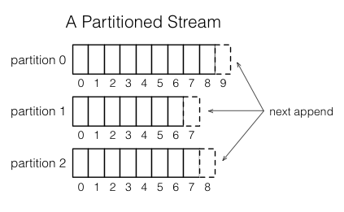
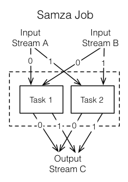

#概念
这一页介绍Samza高层概念。

##Stream

Samza处理流动的数据。流是由相同类型组成的不变的消息集合。例如,一个流可以是一个网站的点击,一个特定的数据库表的更新,或者所有由服务产生的日志,或任何其他类型的事件数据。消息可以被加到一个流或从流中读取。流可以拥有任意数量的消费者,从流中读取不删除消息(因为每个消息实际上是广播给所有消费者)。消息可以有一个关联的键用于分区,我们将在稍后讨论。

Samza是可插拔系统,支持流抽象:在kafka中流是topic,在数据库中，流是对一个表更新操作的读取消费,在Hadoop中可能是tail HDFS文件的目录。

##Jobs

Samza Job是一段逻辑转换代码,完成从一个或多个输入流中读取数据，再输出到一个或多个输出流中。

如果不关注可伸缩性，Streams和Jobs就是所有我们需要的。然而,为了流处理器的吞吐量可扩展,我们把Streams和Jobs分解成更小的并行单位:分区和任务。

##Partitions

每个流被分解为一个或多个分区。流中的每一个分区是完全有序的消息序列。

序列中的每条消息都有一个标识符，叫做偏移量,它在每一个分区中是唯一的。偏移量可以是一个连续的整数,字节偏移,或字符串，主要取决于底层的系统实现。

当一条消息追加到流时,它仅仅追加到流的一个分区。由writer根据键选择消息分配到哪一个分区。例如,如果以用户ID作为键,确保一个用户的消息最终在同一分区内。

##Tasks

一个Job可以分解成多个任务。任务使并行工作的单位,就像流的分区一样。每个任务从一个分区的每个job的输入流消费。

任务从每个输入分区顺序的处理消息,按照消息的偏移量。分区之间是没有顺序的。这样允许每个任务独立工作。YARN调度器将每个任务分配给一台机器,所以整个工作可以分布在许多机器。

一个Job的任务的数量是由输入分区的数量(任务数量不能超过输入分区,否则会有一些任务没有输入)决定的。但是,你可以把计算资源分配给工作(内存,CPU核的数量,等等),以满足Job的需要。请参考下面对容器的说明。

分区分配的任务不会改变:如果机器上的任务失败,会在其他机器重新启动任务,但仍然使用相同的流分区。

##Dataflow Graphs

我们可以组合多个job来创建一个数据流图,节点是数据流,边是job转换。这种组成是通过流的Job作为输入和输出。Job则完全解耦:他们不需要实现在同一个代码库,可以添加、删除或重新启动一个下游的Job不会影响上游Job。

这些图表通常是无环的,数据通常不会从一个Job通过其他Job,回到本身。然而,如果你需要可以创建循环图。

##Containers

分区和任务都是并行的逻辑单元，他们不依赖任何特定的计算资源(CPU、内存、磁盘空间等)。容器是物理上的并行单元，一个容器实际上是一个Unix进程(或Linux cgroup)。每个容器运行一个或多个任务。任务的数量由输入分区的数量来决定，是固定的,但是容器的数量(和与它们相关的CPU和内存资源)是由用户在运行时指定的,随时可以改变。