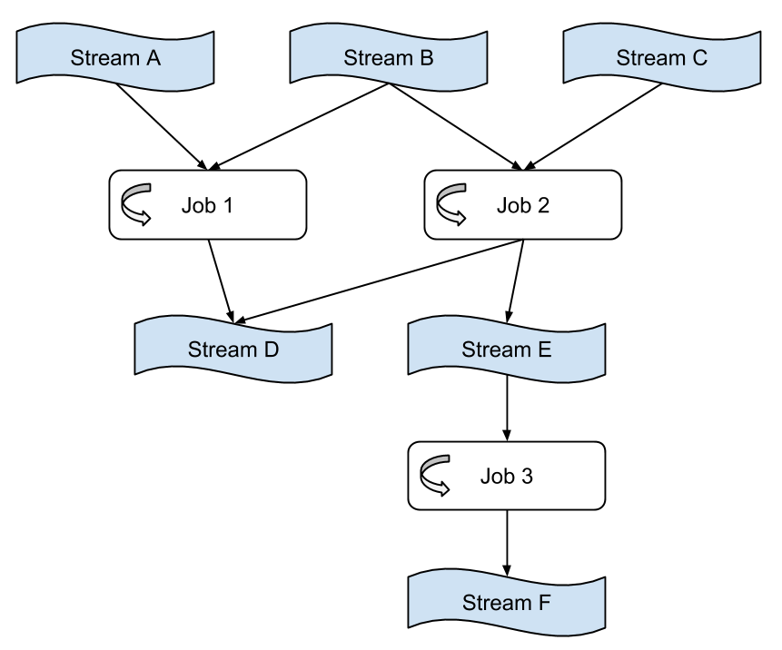

#概念
这一页介绍Samza高层概念。

##Stream

Samza处理流动的数据。流是由相同类型组成的不变的消息集合。例如,一个流可以是一个网站的点击,一个特定的数据库表的更新,或者所有由服务产生的日志,或任何其他类型的事件数据。消息可以被加到一个流或从流中读取。流可以拥有任意数量的消费者,从流中读取不删除消息(因为每个消息实际上是广播给所有消费者)。消息可以有一个关联的键用于分区,我们将在稍后讨论。

Samza是可插拔系统,支持流抽象:在kafka中流是topic,在数据库中，流是对一个表更新操作的读取消费,在Hadoop中可能是tail HDFS文件的目录。

##Jobs

Samza Job是一段逻辑转换代码,完成从一个或多个输入流中读取数据，再输出到一个或多个输出流中。

如果不关注可伸缩性，Streams和Jobs就是所有我们需要的。然而,为了流处理器的吞吐量可扩展,我们把Streams和Jobs分解成更小的并行单位:分区和任务。

##Partitions

每个流被分解为一个或多个分区。流中的每一个分区是完全有序的消息序列。

序列中的每条消息都有一个标识符，叫做偏移量,它在每一个分区中是唯一的。偏移量可以是一个连续的整数,字节偏移,或字符串，主要取决于底层的系统实现。

When a message is appended to a stream, it is appended to only one of the stream’s partitions. The assignment of the message to its partition is done with a key chosen by the writer. For example, if the user ID is used as the key, that ensures that all messages related to a particular user end up in the same partition.

##Tasks

A job is scaled by breaking it into multiple tasks. The task is the unit of parallelism of the job, just as the partition is to the stream. Each task consumes data from one partition for each of the job’s input streams.

A task processes messages from each of its input partitions sequentially, in the order of message offset. There is no defined ordering across partitions. This allows each task to operate independently. The YARN scheduler assigns each task to a machine, so the job as a whole can be distributed across many machines.

The number of tasks in a job is determined by the number of input partitions (there cannot be more tasks than input partitions, or there would be some tasks with no input). However, you can change the computational resources assigned to the job (the amount of memory, number of CPU cores, etc.) to satisfy the job’s needs. See notes on containers below.

The assignment of partitions to tasks never changes: if a task is on a machine that fails, the task is restarted elsewhere, still consuming the same stream partitions.

##Dataflow Graphs

We can compose multiple jobs to create a dataflow graph, where the nodes are streams containing data, and the edges are jobs performing transformations. This composition is done purely through the streams the jobs take as input and output. The jobs are otherwise totally decoupled: they need not be implemented in the same code base, and adding, removing, or restarting a downstream job will not impact an upstream job.

These graphs are often acyclic—that is, data usually doesn’t flow from a job, through other jobs, back to itself. However, it is possible to create cyclic graphs if you need to.

##Containers

Partitions and tasks are both logical units of parallelism—they don’t correspond to any particular assignment of computational resources (CPU, memory, disk space, etc). Containers are the unit of physical parallelism, and a container is essentially a Unix process (or Linux cgroup). Each container runs one or more tasks. The number of tasks is determined automatically from the number of partitions in the input and is fixed, but the number of containers (and the CPU and memory resources associated with them) is specified by the user at run time and can be changed at any time.